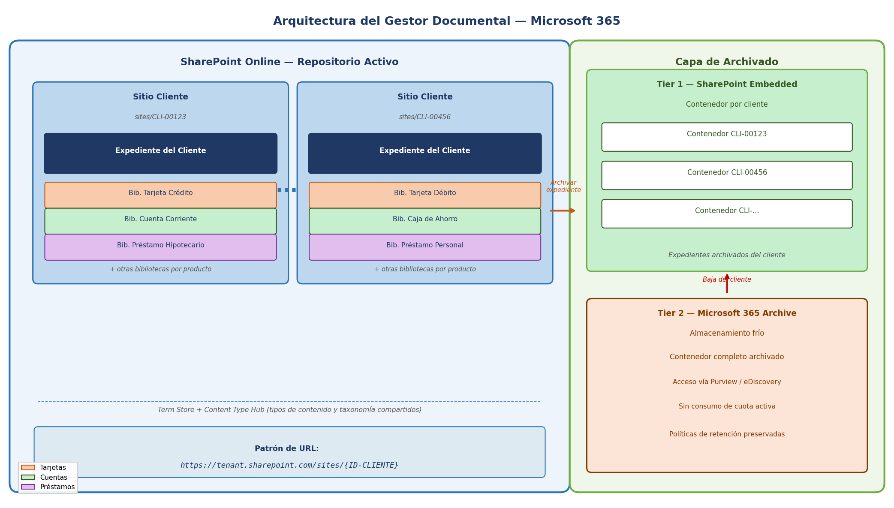
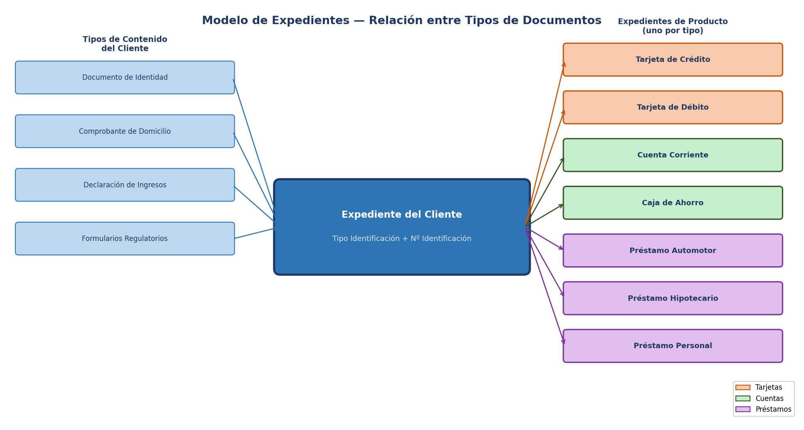

# Gestión Documental Empresarial con Microsoft 365: Un caso de uso en el sector financiero

**Resumen:** Las instituciones financieras gestionan a diario volúmenes considerables de documentación regulatoria, contractual y operativa. En este artículo se describe la arquitectura de un gestor documental empresarial sobre Microsoft 365 y SharePoint Online, orientado a organizaciones que administran múltiples productos por cliente. Se analizan la estructura de expedientes, los tipos de contenido, el modelo de metadatos, el ciclo de vida documental, el archivado inteligente y las capacidades de búsqueda, sirviendo este escenario como hilo conductor para la serie de artículos sobre ECM que se desarrollará en los próximos números de la revista.

---

Nadie puede negar que el crecimiento de Microsoft 365 en los últimos años ha sido exponencial. Las organizaciones del sector financiero —bancos, aseguradoras, entidades de crédito— se encuentran hoy ante una oportunidad concreta: abandonar los repositorios heterogéneos, las carpetas en red y los sistemas de escaneo aislados para adoptar una plataforma unificada de gestión documental empresarial en la nube. La pregunta que surge de inmediato es: ¿cómo se diseña esa plataforma para que sea robusta, auditable y escalable en un entorno donde cada cliente puede tener simultáneamente una cuenta corriente, una tarjeta de crédito, una caja de ahorro y un préstamo hipotecario?

A lo largo de esta serie de artículos se estará recorriendo, capa por capa, la arquitectura de un gestor documental empresarial construido sobre **Microsoft 365, SharePoint Online, SharePoint Embedded y Azure**. En este primer artículo se presenta el caso de uso rector: una institución financiera que necesita gestionar expedientes digitales por cliente y por producto, con ciclo de vida documental controlado, seguridad basada en roles y búsqueda sobre metadatos. Este escenario servirá de referencia concreta para todos los conceptos técnicos que se irán desarrollando en los artículos siguientes.

---

## ¿Cuál es el escenario?

Imaginemos una institución financiera con una base de clientes extensa, tanto personas físicas como jurídicas, donde cada cliente puede acceder a un catálogo variado de productos: tarjetas de crédito y débito, cuentas corrientes, cajas de ahorro, préstamos automotores, hipotecarios y personales. La documentación asociada a cada uno de estos productos tiene características propias: plazos de retención regulatoria diferenciados, tipos de documentos requeridos distintos y procesos de aprobación específicos. Un préstamo hipotecario requiere tasaciones, escrituras e informes de riesgo; una tarjeta de crédito requiere formularios de solicitud, declaraciones de ingresos y contratos de adhesión. Tratar toda esta documentación de la misma manera sería un error de diseño.

El gestor documental que se va a diseñar sobre Microsoft 365 debe resolver tres necesidades centrales: **organizar** la información de manera que cada documento esté correctamente clasificado y sea fácil de encontrar; **proteger** el acceso mediante un modelo de permisos granular y auditable; y **gobernar** el ciclo de vida de cada documento, garantizando que se conserva el tiempo necesario y se archiva cuando corresponde. La plataforma Microsoft 365 ofrece hoy todas las herramientas para lograrlo sin necesidad de infraestructura propia.

---

## Arquitectura de la solución en Microsoft 365

La arquitectura del gestor documental se estructura sobre tres capas principales: **SharePoint Online** como plataforma de almacenamiento y colaboración activa; **SharePoint Embedded** como primera instancia de archivado, por cliente; y **Microsoft 365 Archive** como capa de almacenamiento frío de largo plazo. Esta separación en capas permite escalar el sistema de manera independiente y controlar los costos de almacenamiento según el ciclo de vida de cada expediente. La Imagen 1 ilustra la arquitectura completa.

En la capa activa, cada cliente de la institución dispondrá de su propia **colección de sitios en SharePoint Online**, identificada de forma única mediante un patrón de URL que incorpora el identificador del cliente: `https://tenant.sharepoint.com/sites/{ID-CLIENTE}`. Este diseño garantiza un aislamiento completo entre los espacios documentales de distintos clientes, facilita la aplicación de permisos específicos a nivel de colección de sitios y permite escalar horizontalmente a medida que la base de clientes crece, sin que el crecimiento de un cliente afecte el rendimiento de los demás.

Dentro de cada colección de sitios, la estructura se organiza en dos elementos: el **Expediente del Cliente**, que concentra la documentación de identidad e información general de la persona, y una **biblioteca de documentos por cada tipo de producto** que el cliente tenga contratado. Cada biblioteca tiene sus propios tipos de contenido, columnas de metadatos y políticas de retención, lo que garantiza que las reglas de cumplimiento sean exactamente las correctas para cada producto sin interferencias entre ellos.

*Imagen 1.- Arquitectura del gestor documental: colecciones de sitios por cliente en SharePoint Online, con archivado en SharePoint Embedded (Tier 1) y Microsoft 365 Archive (Tier 2).*

---

## El núcleo del modelo: expedientes de cliente y de producto

El concepto de **expediente** es el eje organizador de toda la información del gestor. Se distinguen dos niveles bien diferenciados, tal como se ilustra en la Imagen 2.

El **Expediente del Cliente** concentra toda la documentación que identifica a la persona con independencia de los productos contratados: documentos de identidad, comprobantes de domicilio, declaraciones de ingresos y formularios de conocimiento del cliente (KYC). En SharePoint Online se implementa como un **Conjunto de Documentos** (Document Set) en la biblioteca principal del sitio del cliente. Este expediente no caduca y permanece activo mientras el cliente mantenga alguna relación con la institución.

Por su parte, el **Expediente del Producto** existe en una instancia separada para cada tipo de producto contratado, alojado en la biblioteca de documentos correspondiente dentro del mismo sitio del cliente. Un mismo cliente puede tener simultáneamente un expediente de tarjeta de crédito, uno de cuenta corriente y uno de préstamo hipotecario, cada uno en su propia biblioteca, con su propia documentación, sus propios metadatos y sus propias políticas de retención.

*Imagen 2.- Modelo de expedientes: el sitio del cliente alberga el Expediente del Cliente y una biblioteca de documentos por cada tipo de producto contratado.*

Los expedientes de producto se implementan utilizando **Conjuntos de Documentos** de SharePoint Online, que permiten agrupar múltiples documentos bajo una entidad con propiedades propias, página de portada personalizada y metadatos que se propagan automáticamente a todos los documentos que los componen.

---

## Taxonomía y tipos de contenido

La taxonomía se centraliza en el **Term Store** de SharePoint Online, y los Tipos de Contenido se publican desde un **Content Type Hub** hacia todos los sitios de clientes. Esto garantiza consistencia en toda la plataforma: si se agrega un nuevo tipo de documento a un producto, la actualización se propaga automáticamente a todos los sitios. Los tipos de contenido se organizan con herencia: tipos base para el Expediente del Cliente y para cada categoría de producto (tarjetas, cuentas, préstamos), de los cuales heredan los tipos específicos de cada documento.

En Microsoft 365, este modelo se complementa con **SharePoint Premium** (anteriormente Syntex), que agrega la capacidad de clasificar y extraer metadatos de los documentos de forma automática mediante modelos de inteligencia artificial entrenados sobre el propio contenido de la organización.

---

## Ciclo de vida documental y retención con Microsoft Purview

Cada tipo de contenido tiene asociada una **etiqueta de retención de Microsoft Purview** que define cuánto tiempo debe permanecer el documento en el repositorio activo. Esta configuración se aplica automáticamente cuando el documento se clasifica con su tipo de contenido. Cuando vence el plazo, Microsoft Purview puede eliminarlo, retenerlo para revisión o disparar un flujo de Power Automate que notifique al responsable para que tome una decisión.

Microsoft recomienda hoy utilizar **Microsoft Purview Data Lifecycle Management** y **Records Management** como el mecanismo estándar de retención en SharePoint Online, en reemplazo de las antiguas políticas de administración de información de SharePoint, cuyo soporte finalizó en abril de 2026.

---

## Archivado en dos capas: SharePoint Embedded y Microsoft 365 Archive

El modelo de archivado se estructura en dos instancias. La primera, basada en **SharePoint Embedded**, actúa como repositorio de archivado activo por cliente: cuando un expediente o documento debe salir del repositorio operativo, se crea un **contenedor en SharePoint Embedded** asociado al identificador del cliente, consolidando todos los expedientes archivados de ese cliente en un espacio lógicamente separado del sitio activo.

La segunda instancia entra en acción cuando el cliente deja de tener relación con la institución: el contenedor completo de SharePoint Embedded se archiva mediante **Microsoft 365 Archive**, pasando a almacenamiento frío sin consumir cuota activa del tenant. Los detalles del proceso de archivado y la configuración de los contenedores se desarrollarán en profundidad en el artículo dedicado a esta temática.

---

## Seguridad, permisos y auditoría

El modelo de seguridad se articula sobre **grupos de Microsoft 365** y políticas de acceso condicional de Microsoft Entra ID. Se definen roles funcionales —Administrador, Supervisor, Operador Documental, Consultor y Solo Lectura— que se asignan a nivel de colección de sitios del cliente, garantizando que cada operador solo puede acceder a los expedientes de los clientes que le corresponden.

La auditoría registra todas las operaciones sobre cada expediente: creación, modificación, eliminación y archivado. Microsoft Purview centraliza estos registros en el Unified Audit Log, con capacidad de alerta ante comportamientos anómalos y exportación hacia sistemas SIEM corporativos.

---

## Búsqueda y acceso a la información

El acceso a la documentación se resuelve mediante **Microsoft Search**, que indexa el contenido de todos los sitios de SharePoint Online de manera continua. Los usuarios pueden realizar búsquedas avanzadas con el lenguaje KQL filtrando por número de cliente, tipo de producto, fecha de vigencia y estado del documento. En el horizonte inmediato, el **SharePoint Knowledge Agent** —disponible con licencia Microsoft 365 Copilot desde 2026— permitirá formular consultas en lenguaje natural directamente sobre el contenido del gestor documental.

---

## Conclusión

En este artículo se trató de demostrar cómo una institución financiera puede diseñar un gestor documental robusto y escalable sobre Microsoft 365, articulado alrededor del concepto de colección de sitios por cliente, con una biblioteca de documentos por tipo de producto y un modelo de archivado en dos capas que combina SharePoint Embedded y Microsoft 365 Archive. En próximos artículos se estará desarrollando en detalle cada uno de los pilares de esta arquitectura. A continuación se detalla el temario completo de la serie:

1. **Artículo 1: Licencias para ECM en Microsoft 365** — planes M365, SharePoint Premium, SharePoint Embedded y Microsoft Purview Add-on
2. **Artículo 2: Estructura Documental** — jerarquía de sitios, hub sites, bibliotecas y tipos de contenido
3. **Artículo 3: Metadatos** — Term Store, columnas de sitio, herencia y metadatos en la era Copilot
4. **Artículo 4: Gobernabilidad y Seguridad** — permisos, grupos de Microsoft 365, SharePoint Advanced Management y Data Access Governance
5. **Artículo 5: Procesos y flujos de trabajo** — Power Automate, aprobaciones y ciclo de vida documental
6. **Artículo 6: Cumplimiento y retención con Microsoft Purview** — etiquetas de retención, Records Management y DLP
7. **Artículo 7: Catalogación y clasificación** — SharePoint Premium / Syntex, clasificación automática y etiquetas de sensibilidad
8. **Artículo 8: Migración a ECM moderno** — auditoría de contenido, estrategia de migración y gestión del cambio
9. **Artículo 9: Almacenamiento — Sitios SharePoint Online** — colecciones de sitios, cuotas y políticas de ciclo de vida
10. **Artículo 10: Almacenamiento — SharePoint Embedded** — contenedores, API, modelo de costos y archivado
11. **Artículo 11: Búsquedas** — Microsoft Search, KQL, conectores de Graph y SharePoint Knowledge Agent
12. **Artículo 12: Integración con APIs y Graph** — Microsoft Graph API, SPFx, REST API y webhooks
13. **Artículo 13: Azure AI e inteligencia documental** — Azure Document Intelligence, OCR y procesamiento multimodal
14. **Artículo 14: Copilot y ECM** — cómo la arquitectura de información impacta las respuestas de Copilot
15. **Artículo 15: Copilot Studio Agents sobre contenido documental** — agentes autónomos sobre repositorios SharePoint
16. **Artículo 16: Formularios y captura inteligente de documentos** — custom upload forms y captura estructurada en el ingreso

---

**Fabián Imaz**
Office Apps and Services MVP
CEO Siderys | CTO qualitaslearning.com
fabiani@siderys.com.uy | @fabianimaz
